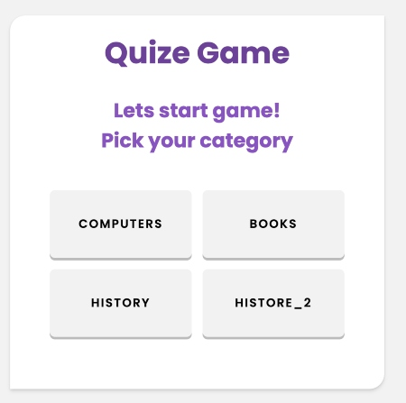
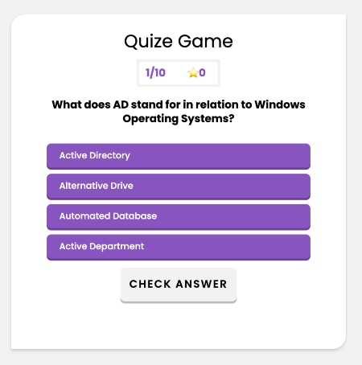
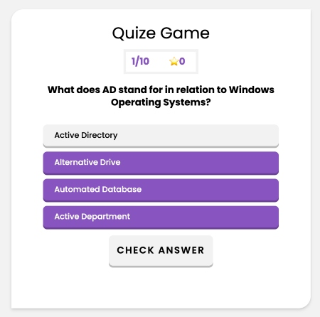
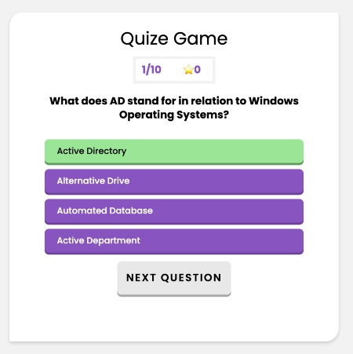
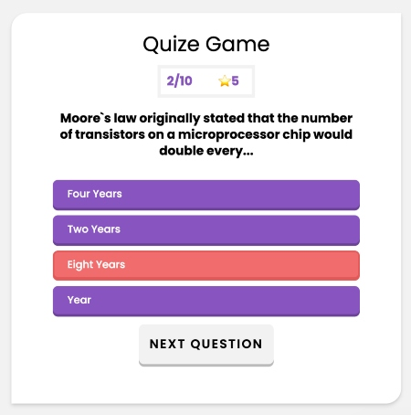
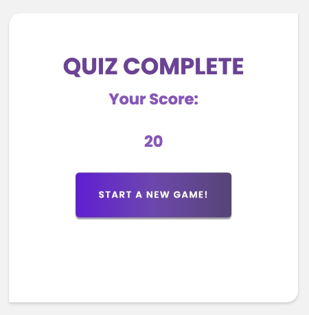

# Trivia Game.

## Live demo:

https://annadruzhinina.github.io/Project1_Trivia/

This is a front-end web application developed as my first personal project while studying at General
Assembly.

## TriviaGame:

### Project Description:

Trivia is a type of game in which players are asked questions about different topics and they have to get as many correct answers as possible. Trivia contests are usually organized as part of events, parties and as pub entertainment. Normally contestants are organized in teams and the team who gets the higher score wins.

### Benefits of playing trivia and quiz games:

Unfortunately every year we grow a bit older and we realize that our mind is not as sharp and fast as it used to be. If we don’t train our brain, it gets harder for us to remember, concentrate and learn new skills and information.
Quiz questions can help prevent this process to go so fast as it serves as a form of exercise for our brain.

3. If the player selects the correct answer, show a screen congratulating them for choosing the right option. After a few seconds, display the next question -- do this without user input.
4. On the final screen, show the number of correct answers, incorrect answers, and an option to restart the game (without reloading the page).

5. Choose category;

<div style="text-align:center"></div>

<br> 6. Display random questions from the question set;<br>
<br> 7. Pick one answer (the button's background is changed to green color grey) and click on the "Check Answer" button:<br>
<br>

- if the answer is correct: the button's background is changed to green color, starScore update +5, question +1/10, and appear button "Next Question";<br>
  <br>
- if the answer is incorrect: the button's background is changed to red color, starScore dosen't update, question +1/10, and appear button "Next Question";<br>
  <br>

4. Final screen:

- if user answered all questions right:
  ![src/quiz_complete_maxScore.png)
- if user didn't answered all questions right:
  

## Technology:

JavaScript
HTML/CSS

## Technical requirements

In this assignment, You'll create a Trivia game using JavaScript for the logic and DOM to manipulate HTML. se semantic, valid markup for HTML and CSS (must pass validation without errors)

## Technologies Used

Front-end: HTML, CSS;

## Additional resources:

A beautiful, responsive, customizable accessibility (WAI-ARIA) replacement for JavaScript popup boxes.
[https://sweetalert2.github.io/#frameworks-integrations](https://sweetalert2.github.io/#frameworks-integrations)

### Download & Install

```bash
npm install sweetalert2
```

### Or grab from: [jsdelivr CDN](https://www.jsdelivr.com/package/npm/sweetalert2) ;

```bash
<script src="//cdn.jsdelivr.net/npm/sweetalert2@11"></script>
```

### Generate Trivia questions:

[https://opentdb.com/api_config.php](https://opentdb.com/api_config.php) ;

[https://jsonformatter.org/json-pretty-print](https://jsonformatter.org/json-pretty-print) - JSON Pretty Print;

Before You Begin:

1. Launch on

Future Features:

1. Make this app a team game;
2. Add timer;
3. If the player selects the correct answer, show a screen congratulating them for choosing the right option. After a few seconds, display the next question -- do this without user input.
4. Display competition page where users can see:

- a bunch of teams or just individual score,
- the time that each team spent on the game,
- correct and incorrect answers by team,

5. Calculate the winning score using each team's total score and time spent
